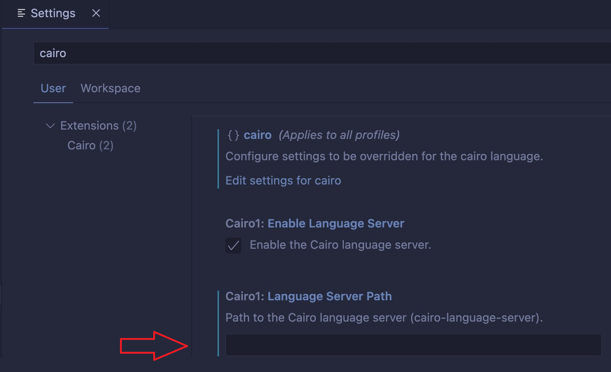

# Installation

Install Node.js 18 LTS:
See troubleshooting section.

From the directory of this file, run:

```
sudo npm install --global @vscode/vsce
npm install
vsce package
code --install-extension cairo1*.vsix
```

Remember to build the language server:

```
cargo build --bin cairo-language-server --release
```

Now open vscode, find the Cairo extension and fill in the path to the cairo language server:



It should look like:
`/path/cairo/target/release/cairo-language-server`
Where _path_ is the path to the cairo folder you got when cloning this repository.

## Troubleshooting

If `sudo npm install -g vsce` fails try this:

```
sudo apt remove nodejs
sudo apt update
sudo apt install curl dirmngr apt-transport-https lsb-release ca-certificates vim
curl -sL https://deb.nodesource.com/setup_18.x | sudo -E bash -
sudo apt install nodejs
```

If successful, go back to `sudo npm install -g vsce` and continue from there.

# Run the extension (for development)

1. Open VSCode in the directory of this file.
2. Run:
   ```
   npm install
   npm run compile
   ```
3. Reload VSCode.
4. Press F5.

# Debugging

To make the "Debug"/"Run" CodeLens above your tests work - add this to your ~/.config/Code/User/settings.json:

```
"rust-analyzer.runnableEnv": {
   "CARGO_MANIFEST_DIR": "/path/to/workspace/repo_name/any_dir"
},
```

If you also want logs to be printed in your VSCode terminal when you click the "Debug"/"Run" CodeLens above your tests, also add the "RUST_LOG" field:

```
"rust-analyzer.runnableEnv": {
   "CARGO_MANIFEST_DIR": "/path/to/workspace/repo_name/any_dir",
   "RUST_LOG": "debug,salsa=off,minilp=off"
},
```

Use `debug`/`trace` at your preference.
